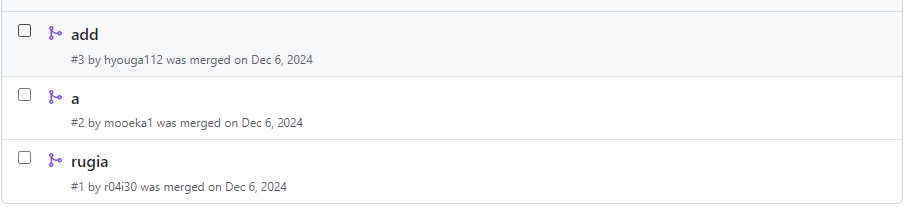
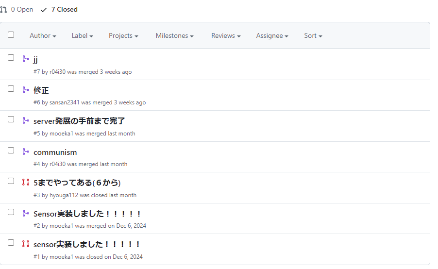

# チーム開発
### <div style="text-align:right;">3I38 松井三吉</div>
## 目的
- 一つのシステムを複数人からなるチームで構築するポイントや流れを理解する  
- 一つのシステム(システムは複数のプログラムの集合体)を複数人で実装する経験を積む  
- git/githubのpull requestを使ったコードレビューとマージの概念を理解し、実践する  
- 開発だけではなく、運用を想定し、開発環境や使うツールの選定や整備を経験する  

## 使用するツール
- docker, docker-compose
- Node.js
- React
- socket.io
- MySQL
- SQLAlchemny
- marshmallow
- git
- github

## 課題１　gitの練習
### 目的
> 数人で開発する時のソースコード等の共有をgithubで行う時の注意点やコツを理解する。
ブランチは、ファイルの変更履歴の流れを分岐して記録していくためのものである。分岐したブランチは他のブランチに影響を与えない・影響を受けないため、複数の変更を同時並行して進めていくことができる。


### 手順
1. チームメンバーを確認する(3または4人)欠席がいた場合位は残りの人で頑張る(休んだ人は次週までに追いつく)。
1. チームリーダーを決める。リーダーはリンクからGitHub Campusでチームを作成し(チーム名はチーム番号)、リームのリポジトリを作成する。
1. チームリーダーはチームメンバーをリポジトリの開発者として追加する（他の人はアカウント名を教え、近くで見ていること）。
1. Branchに対するpush/pullの練習、pull requestの練習を行う

### pull requestの結果


更新場所が重複しない場合はコンフリクトが起こらず重複した場合は起こった


### pull requestにより何が実現できているか
複数人が同時に作業することができ同じ箇所を変更した場合にもbranchで分けているのでそのタイミングでは円滑に開発がすすめられ最終的にMargeのタイミングでMargeする人がコンフリクトを解消することができる。また各部の開発部分の変更を見やすいため間違いに気づきやすくなる。


## 課題2　チーム開発
### 共同開発者
|番号|名前|
|----|----|
|22|竹野萌花|
|27|野田飛翔|
|31|廣瀬充希|

### 担当パート
Marge役（チームリーダー）

### 担当パートの確認方法
1. Pull Requestを送ってもらう
1. コードを確認し間違いがないかを確認
1. コンフリクトが起こっているかを確認
   - コンフリクトが起こっていれば解消する
1. Margeする
   
### 担当パートの結果

> 一度だけコンフリクトがcompose.ymlファイルで起きた  
消すだけだったので消去し解決

### チーム全体で作成したシステムの確認方法
1. それぞれのパートで確認作業を行う
1. すべてをMargeしたdev branchで動作するかを確認
### チーム全体で作成したシステムの結果


エラーが起こったが修正し正しく動作した  

#### エラー内容
送る情報が多すぎたエラーが起こった

#### エラー原因

修正前
```python
@socketio.on('requredata')
def requredata():
    # DBから取得
    locdata = session.query(Locdata).all()
    # JSON <-> Object 変換スキーマ
    schema = LocdataSchema(many=True)
    # Object -> JSON -> JSON String に変換
    jsonobj = schema.dumps(locdata)
    jsonstring = json.dumps(jsonobj)
    # 'geoloc'メッセージで送る
    emit('geoloc',jsonstring)
    pass
```
修正後
```python
@socketio.on('requredata')
def requredata():
    # DBから取得
    locdata = session.query(Locdata).all()
    # JSON <-> Object 変換スキーマ
    schema = LocdataSchema(many=True)
    # Object -> JSON -> JSON String に変換
    jsonobj = schema.dump(locdata)
    jsonstring = json.dumps(jsonobj)
    # 'geoloc'メッセージで送る
    emit('geoloc',jsonstring)
    pass
```
schema.dumpがschema.dumpsになっていたためにファイルに正しく書き込む処理が行われていなかった

### 実験を通じて気づいたチームで開発するときの注意点
ある程度開発したことがある人はスムーズに開発が進むがあまりしていない人はgitの使い方から始まるため初めての人と開発するときは気を付けなければならない。
また、あまり考えずにその開発パートが終わっていないのにpull requestを送っている人がいたり
pull requestを送る先を間違えていたりするのでMargeする際には細心の注意を払わなければならないと考える

## 理解したこと、理解できていないこと
gitの使い方を再確認できてあまりやったことのないMargeをできた。理解したこととしてよく見ないとエラーが分からないことと正確に確認しても見逃していることがあり後で苦しくなることを理解した。理解できなかったことは、VSCodeのエラーメッセージにエラーが出た部分にかかわることが出てこなかったことです。